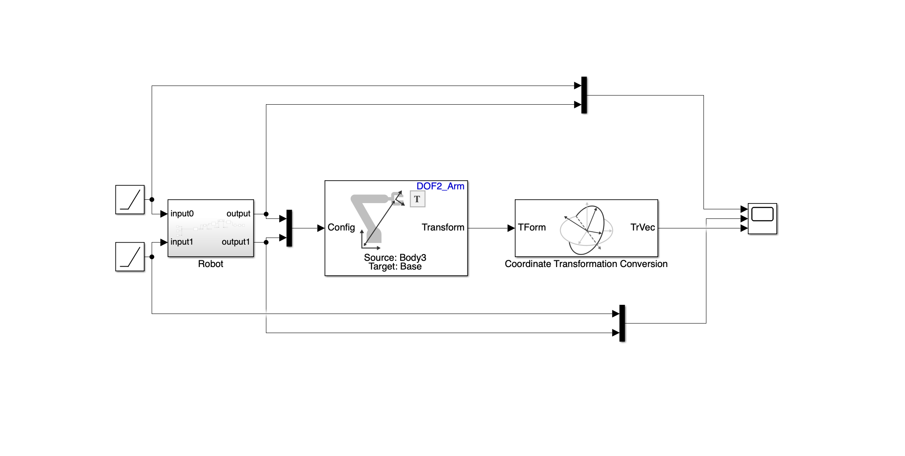

# 2-DOF Robotic Arm Kinematics Simulation

This project simulates a 2-DoF robotic arm using MATLAB and Simulink, focusing on the visualization and computation of 2 Degrees of Freedom(DoF) Forward Kinematics.

---

## Project Contents

| File/Folder                                   | Description 
|-----------------------------------------------|-------------
| `Arm2.m`                                      | MATLAB script to load the robot from the URDF and open the model 
| `DOF_2.slx`                                   | Simulink model simulating the 2-DOF robot dynamics 
| `ForwardKinematics_2Dof.slx`                  | Simulink model for computing and extracting the end-effector position using Transform Tree 
| `Block_diagram.png`                           | Block diagram of the forward kinematics setup 
| `Output.png`                                  | Simulation output Image
| `Demo.mov`                                    | Demonstration of the working simulation 

---

## What this Project is about

- **2-DOF Robotic arm modeling**
- **Forward kinematics computation using Simulink's Transform Tree**
- **Real-time extraction of end-effector position (X, Y, Z)**
- **Modular Simulink design using Robotics System Toolbox**

---

## Requirements

- MATLAB R2023a or later
- Simulink
- [Robotics System Toolbox](https://www.mathworks.com/products/robotics.html)

---

## Block Diagram


---

## Getting Started

1. Clone this repository:
    ```git clone https://github.com/yourusername/2DOF-Robot-Kinematics-Simulation.git```
2. Open Arm2.M in MATLAB.In the Editor Tab click the **Run** button. (Click **Add to Path** if a window appears).
   If **>>Arm2** is displayed then it is running sucessfully.
3. Open ForwardKinematics_2Dof.slx in Simulink and Click the Run button in the Simulation Tab.
4. The model will load.
5. Tinker with the parameters as desired.

